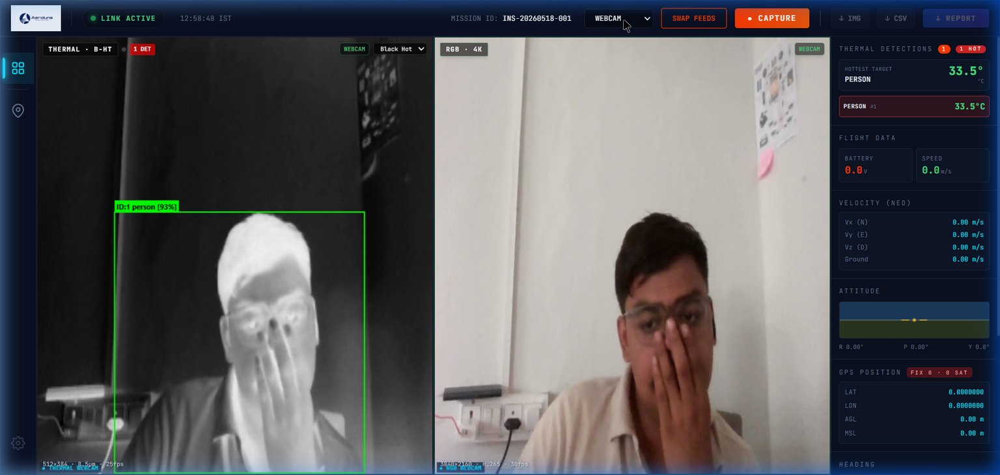
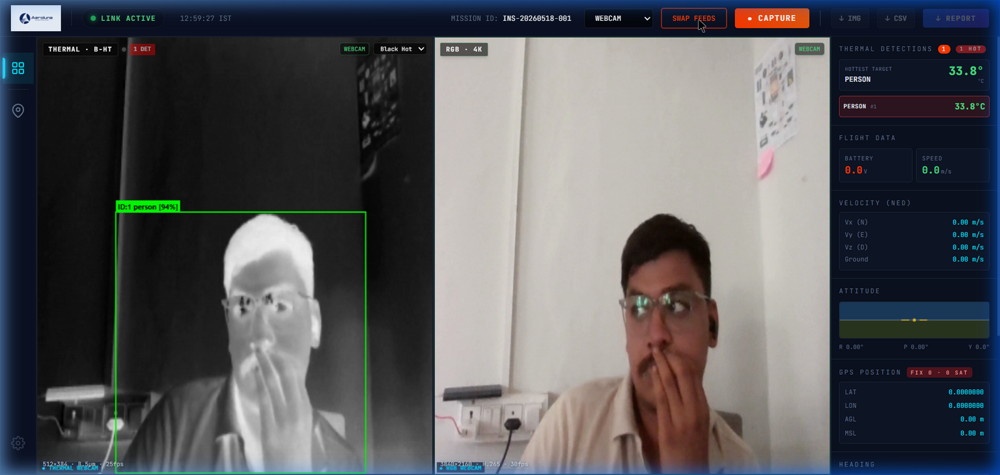
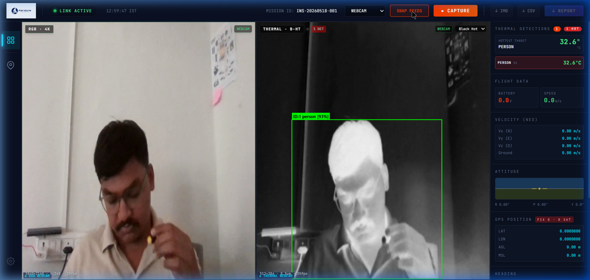

# 🛸 Aeroluna Thermal Project

**TIOS v2.3 — Thermal Inspection Operating System**  
A real-time drone-based thermal inspection platform with high-precision GPS geotagging, live MAVLink telemetry, YOLO-powered object tracking, thermal anomaly detection, and automated PDF/CSV mission reporting.

[](https://github.com/amogha-prog/thermal_project1/tree/main)
[](#-tech-stack)
[](#-ml--vision-pipeline)

---

## 🆕 What's New — v2.3

| # | Feature | Details |
|---|---|---|
| ✅ | **YOLO Object Tracking in Thermal View** | Live bounding boxes with tracker IDs, species labels (`PERSON`, `DOG`, `ELEPHANT`, etc.) and confidence % rendered directly on the thermal camera panel |
| ✅ | **TF Detection via `tf_detector.py`** | Flask MJPEG server streams clean raw frames; YOLO runs in background thread and broadcasts per-object detections over UDP → telemetry sidebar |
| ✅ | **Thermal Detections Sidebar Panel** | Right sidebar shows "Hottest Target" card (object name + large temperature readout) + per-object rows with colour-coded temperatures |
| ✅ | **Temperature in Telemetry Only** | Temperature is removed from the camera screen entirely — only visible in the right-side telemetry panel |
| ✅ | **Luma-Based Thermal Temp Estimation** | Per-bounding-box luma average mapped to 20 °C – 45 °C scale (upgrades to raw 16-bit FLIR values when a real thermal camera is attached) |
| ✅ | **SSD MobileNet V2 COCO Model** | `frozen_inference_graph.pb` + `.pbtxt` included for fallback OpenCV DNN inference |
| ✅ | **v2 High-Precision Geotag Engine** | Sub-100 ms GPS synchronisation using kinematic NED buffers + EMA-locked TimeSync |
| ✅ | **Webcam / RTSP Dual Support** | Object detection works for both the laptop webcam and a live RTSP thermal drone stream |

---

## 📸 Screenshots

### Live Dashboard — Thermal + RGB + Telemetry Sidebar
*Thermal camera (Black Hot palette) on the left with YOLO tracker active · RGB feed on the right · Telemetry sidebar showing Thermal Detections panel*



---

### YOLO Object Tracker on Thermal Camera
*Green bounding box with `ID:1 person [94%]` label · Sidebar showing Hottest Target = PERSON at 33.8°C*



---

### Swapped View — RGB Left · Thermal Right
*SWAP FEEDS button moves the RGB feed to the primary position · Thermal tracker continues tracking on the right panel*




---

## 📁 Project Structure

```
aeroluna thermal project/
├── tios2/                              # Main TIOS web application
│   ├── frontend/                       # React + Vite UI  (port 5173)
│   │   └── src/
│   │       ├── components/
│   │       │   ├── video/
│   │       │   │   └── VideoPanel.jsx  # ★ YOLO tracker overlay (thermal only)
│   │       │   └── telemetry/
│   │       │       └── TelemetrySidebar.jsx  # ★ Thermal Detections panel
│   │       └── store/
│   │           └── useTIOSStore.js     # Zustand global state
│   │
│   └── backend/                        # Node.js + Socket.io backend  (port 4000)
│       ├── src/
│       │   ├── server.js               # Express + Socket.io server
│       │   ├── mavlink/
│       │   │   └── mavlinkParser.js    # UDP / serial / LAN / simulation
│       │   ├── stream/
│       │   │   └── streamRelay.js      # RTSP → FFmpeg → WebSocket relay
│       │   └── python/
│       │       └── pythonBridge.js     # Detection UDP receiver (port 14560)
│       │
│       ├── python/                     # ML + thermal analysis pipeline
│       │   ├── main.py                 # Pipeline orchestrator
│       │   ├── hotspot_detector.py     # ★ YOLO11 thermal anomaly detection
│       │   ├── classifier.py           # YOLO11 classification
│       │   ├── auto_capture.py         # Auto-capture on anomaly trigger
│       │   ├── stream_reader.py        # Dual RTSP ingestion
│       │   ├── false_positive_filter.py
│       │   ├── generate_report.py      # PDF report generator (FPDF2)
│       │   ├── test_laptop_camera.py   # ★ Standalone webcam YOLO test
│       │   └── gps_mavlink.py          # Standalone MAVLink bridge (legacy)
│       │
│       ├── tf_detector.py              # ★ Flask MJPEG + YOLO tracking server
│       ├── ssd_mobilenet_v2_coco_2018_03_29/  # ★ TF model (OpenCV DNN fallback)
│       ├── ssd_mobilenet_v2_coco_2018_03_29.pbtxt
│       ├── drone_bridge.py             # ★ PRIMARY MAVLink bridge (v2 engine)
│       ├── wake_drone.py               # Controller wake-up tool
│       └── debug_udp.py                # Raw MAVLink packet inspector
│
├── v2/                                 # ★ High-precision geotag engine
│   ├── main.py                         # Standalone v2 entry point (testing)
│   ├── time_sync.py                    # GPS ↔ monotonic clock synchronisation
│   ├── buffers.py                      # Kinematic ring buffers (GPS + Attitude)
│   ├── frame_tagger.py                 # Per-frame metadata assembler
│   └── calibration/
│       └── ekf_delay_calibrator.py     # Offline EKF delay sweep tool
│
├── captures/                           # Mission capture images
└── yolo11n.pt                          # Base YOLO11 detection model
```

---

## 🚀 Quick Start

### 1. Install dependencies
```bash
cd tios2
npm run install:all
```

### 2. Install Python dependencies
```bash
pip install flask flask-cors opencv-python numpy pymavlink ultralytics
```

### 3. Start the system

**Terminal 1 — Backend (Node.js)**
```bash
cd tios2/backend
npm run dev
```

**Terminal 2 — Frontend (React)**
```bash
cd tios2/frontend
npm run dev
```

**Terminal 3 — Object Detection Server (Python)**
```bash
cd tios2/backend
python tf_detector.py
```

**Terminal 4 — MAVLink Geotag Bridge (Python)**
```bash
cd tios2/backend
python drone_bridge.py
```

Open **http://localhost:5173**

> If your drone controller needs a wake-up signal first:
> ```bash
> python wake_drone.py
> ```

---

## 🌐 Architecture Overview

```
┌─────────────────────────────────────────────────────────────────────┐
│                    AEROLUNA TIOS v2.3 ARCHITECTURE                  │
└─────────────────────────────────────────────────────────────────────┘

Flight Controller (ArduPilot / PX4)
        │  MAVLink over UDP :14550 / :14555
        ▼
  drone_bridge.py  (v2 engine)
        │
        ├─ SYSTEM_TIME ──────► TimeSync (EMA lock, drift monitor)
        ├─ GLOBAL_POSITION_INT ► GPSBuffer (NED kinematic interpolation)
        ├─ ATTITUDE ──────────► AttitudeBuffer (shortest-path interpolation)
        │
        ├─ Telemetry JSON @ 25 Hz ──► Node.js :14556 ──► Socket.io ──► Dashboard
        └─ Geotag query server :14557 ◄── auto_capture.py

Webcam / RTSP Thermal Camera
        │
        ▼
  tf_detector.py  (Flask server :5000)
        │
        ├─ MJPEG stream ──────────► VideoPanel.jsx (raw frame → thermal LUT applied)
        │   /video_feed/webcam        Green YOLO bounding boxes drawn on top
        │   /video_feed/thermal
        │
        └─ Detection UDP :14560 ──► pythonBridge.js ──► Socket.io ──► TelemetrySidebar.jsx
             { id, label, bbox,        (Node.js relay)                  Hottest Target card
               max_temp, severity }                                      Per-object temp rows

React Dashboard (Vite :5173)
        ├─ VideoPanel.jsx      ← thermal LUT + YOLO tracker overlay
        ├─ TelemetrySidebar.jsx ← flight telemetry + Thermal Detections panel
        └─ TopBar / ScanBar    ← CAPTURE / PDF / CSV buttons
```

---

## 🤖 Object Tracking — `tf_detector.py`

The new `tf_detector.py` is a Flask-based detection server that runs alongside the web app.

### How It Works

1. **Single Camera Thread** — Opens webcam once; all endpoints share the same frame
2. **YOLO Inference** — Uses `HotspotDetector` (backed by `yolo11n.pt`) for object tracking with persistent IDs across frames
3. **Temperature Estimation** — Samples average pixel brightness in each bounding box ROI and maps it to `20 °C – 45 °C` (thermal simulation; upgrades to real FLIR 16-bit values with drone camera)
4. **UDP Broadcast** — Emits detection JSON to port `14560` every frame → Node.js → Socket.io → sidebar
5. **Raw MJPEG Stream** — Serves clean un-annotated JPEG frames so the React frontend can apply its own thermal palette (Black Hot / White Hot) before drawing tracker overlays

### Detection Payload (UDP, JSON)
```json
{
  "type": "detections",
  "detections": [
    {
      "id": 1,
      "label": "person",
      "confidence": 0.87,
      "x": 142, "y": 98, "w": 180, "h": 310,
      "max_temp": 36.4,
      "severity": "CRITICAL",
      "is_scaled": false
    }
  ],
  "count": 412,
  "timestamp": 1747543312000
}
```

### Warm-Class Objects (CRITICAL severity)
`person`, `bird`, `cat`, `dog`, `horse`, `sheep`, `cow`, `elephant`, `bear`, `zebra`, `giraffe`

### API Endpoints
| Endpoint | Description |
|---|---|
| `GET /video_feed/webcam` | Raw MJPEG stream from laptop webcam |
| `GET /video_feed/thermal` | Raw MJPEG stream from thermal RTSP camera |
| `GET /api/snapshot` | Single JPEG frame (for capture) |

---

## ⚙️ v2 Geotag Engine

The `v2/` module provides the high-precision geotagging system used by `drone_bridge.py`.

### Time Domain Rule
> **Every geotag-critical timestamp is `monotonic → GPS epoch`. Never `time.time()`.**

| Timestamp use | Method | Precision |
|---|---|---|
| GPS buffer entries | `boot_to_utc(boot_ms)` | ±1 ms |
| Attitude buffer entries | `boot_to_utc(boot_ms)` | ±1 ms |
| Frame capture time | `to_drone_time(mono − VIDEO_LATENCY)` | ±2 ms |
| Buffer query time | `frame_time − EKF_DELAY` | ±1 ms |
| Bootstrap (fallback) | `time.time()` once only | ±50–500 ms |

### Modules

#### `time_sync.py` — `TimeSync`
- Converts `time.monotonic()` to GPS UTC epoch via SYSTEM_TIME messages
- Two EMA rates: `alpha_fast=0.3` (pull-in) → `alpha_slow=0.05` (locked)
- **Lock threshold:** 150 ms · **Drift monitor:** logs if offset shifts > 10 ms/update
- **Wall-clock bootstrap:** auto-overridden by first real GPS message

#### `buffers.py` — `GPSBuffer` + `AttitudeBuffer`
- **`AttitudeBuffer`:** `max_gap=150 ms`, angle-safe shortest-path yaw interpolation
- **`GPSBuffer`:** Full NED kinematic model with hard/soft gates for high-speed edge cases

#### `frame_tagger.py` — `tag_frame()`
- `EKF_DELAY = 0.10 s` — subtracts FC EKF output latency before querying buffers
- Returns structured metadata dict per frame (lat, lon, alt, velocity, attitude, heading, battery)

---

## 🔌 Port Map

| Port | Protocol | Direction | Purpose |
|---|---|---|---|
| 14550 | UDP | FC → Bridge | MAVLink from drone (primary) |
| 14555 | UDP | FC → Bridge | MAVLink from drone (fallback) |
| 14556 | UDP | Bridge → Node | Telemetry JSON @ 25 Hz |
| 14557 | UDP | auto_capture → Bridge | Geotag query/response |
| 14560 | UDP | tf_detector → Node | YOLO detection events (per-frame) |
| 4000  | HTTP/WS | Node → Browser | REST API + Socket.io |
| 5000  | HTTP | tf_detector → Browser | MJPEG video streams |
| 5173  | HTTP | Vite → Browser | React dev server |

---

## 🔧 Configuration

### Environment Variables
```bash
# Camera pipeline lag — tune per camera with LED-flash measurement
VIDEO_LATENCY=0.120 python drone_bridge.py

# RTSP URL for thermal camera
THERMAL_RTSP_URL=rtsp://192.168.144.25:8554/main.264
```

| Variable | Default | Description |
|---|---|---|
| `VIDEO_LATENCY` | `0.150` | Camera pipeline lag in seconds |
| `THERMAL_RTSP_URL` | `rtsp://192.168.144.25:8554/main.264` | Drone thermal RTSP stream URL |

### Compile-Time Constants

**`v2/frame_tagger.py`**
| Constant | Default | Description |
|---|---|---|
| `EKF_DELAY` | `0.10` s | FC EKF output latency — calibrate with `ekf_delay_calibrator.py` |

**`tf_detector.py`**
| Constant | Default | Description |
|---|---|---|
| `YOLO confidence` | `0.25` | Minimum YOLO detection confidence |
| Temp range | `20–45 °C` | Simulated thermal scale (luma-mapped) |

---

## 📡 drone_bridge.py — Health Output

Every 3 seconds:
```
[13:35:24] DATA RATES | GPS: 10.0 Hz (Age: 0.3s) | Attitude: 50.0 Hz (Age: 0.1s)
[13:35:24] SYNC | Offset: 1778046456097.6 ms | Locked: True | Drift: 0.05 ms/s | EKF_DELAY: 100 ms
```

Every 100 packets:
```
[13:35:24] OK | mode=LOITER armed=True lat=12.97150 lon=77.59460 agl=45.2m spd=2.1m/s bat=24.1V sync_err=0.002s
```

---

## 🔋 Pre-Flight Checklist

```
🔴 REQUIRED
  □ Start tf_detector.py (object tracking server)
  □ Start drone_bridge.py (MAVLink telemetry)
  □ Calibrate EKF_DELAY via ekf_delay_calibrator.py
  □ Measure VIDEO_LATENCY for your camera (LED flash method)

🟠 RECOMMENDED
  □ Confirm "Locked: True" within 10 s of drone connect
  □ Confirm green YOLO boxes on thermal panel at startup (laptop cam test)
  □ GPS Hz ≥ 5 Hz, Attitude Hz ≥ 10 Hz in health output
  □ Drift < 1.0 ms/s during 5-minute ground test

🟢 PRODUCTION
  □ Set THERMAL_RTSP_URL= in backend/.env
  □ Set MAVLINK_CONNECTION=lan in backend/.env
  □ Ensure SYSTEM_TIME stream is enabled on FC
```

---

## 🤖 ML / Vision Pipeline

```
Webcam / RTSP Thermal Camera
        │
        ▼
  tf_detector.py
  ┌─────────────────────────────────────────────────┐
  │  Camera Thread (background)                      │
  │  ├── cv2.VideoCapture(0) / RTSP                 │
  │  ├── HotspotDetector.detect(frame)              │
  │  │     └── yolo11n.pt (.track mode, IDs)        │
  │  ├── estimate_temp(bbox) → 20–45°C luma map     │
  │  ├── UDP broadcast → Node.js :14560             │
  │  └── MJPEG raw frame → /video_feed/webcam       │
  └─────────────────────────────────────────────────┘
        │                         │
        ▼                         ▼
  TelemetrySidebar.jsx      VideoPanel.jsx
  (temp + species list)     (thermal LUT → YOLO overlay)
```

---

## 🐛 Troubleshooting

| Symptom | Cause | Fix |
|---|---|---|
| Tracker shows everything as "person" | Low YOLO confidence / wrong model | Ensure `yolo11n.pt` is at repo root; lower `yolo_confidence` |
| No bounding boxes in thermal view | `tf_detector.py` not running | Start `python tf_detector.py` in backend dir |
| Temperature always shows `—` | `max_temp` not in UDP payload | Restart `tf_detector.py` (new version required) |
| Camera not opening | Windows DirectShow conflict | Close other apps using webcam; restart Python |
| `Warmup: only N GPS samples` | Buffer hasn't filled yet | Wait ~1 s after telemetry starts |
| `Sync unstable — locked=False` | SYSTEM_TIME not streaming | Enable SYSTEM_TIME on FC |
| Video not showing | FFmpeg missing or wrong RTSP URL | Install FFmpeg, check `.env` URLs |
| `Port busy (WinError 10013)` | QGC/MP already on port | Close QGC or change SOURCES in `drone_bridge.py` |
| PDF empty | No captures in session | Press CAPTURE at least once |

---

## 📦 Tech Stack

| Layer | Technology |
|---|---|
| Frontend | React 18, Vite, Zustand, Leaflet, Socket.io-client |
| Backend | Node.js, Express, Socket.io, FFmpeg |
| Object Tracking | YOLO11 (Ultralytics `yolo11n.pt`), OpenCV DNN |
| TF Fallback Model | SSD MobileNet V2 COCO (OpenCV DNN `.pb` backend) |
| Geotag Engine | Python 3.10+, pymavlink, custom v2 modules |
| Thermal Processing | OpenCV luma → palette LUT (Black Hot / White Hot) |
| Reporting | FPDF2 (Python), jsPDF (browser PDF) |
| Video Streaming | Flask MJPEG, FFmpeg RTSP, WebSocket |
| Telemetry | MAVLink (pymavlink), UDP |

---

## 🔗 Key Files Quick Reference

| File | Role |
|---|---|
| `tios2/backend/tf_detector.py` | **★ NEW** Flask MJPEG server + YOLO tracking + UDP broadcast |
| `tios2/backend/python/hotspot_detector.py` | YOLO11 thermal hotspot detector (with tracker IDs) |
| `tios2/backend/python/test_laptop_camera.py` | **★ NEW** Standalone webcam YOLO test (desktop window) |
| `tios2/frontend/src/components/video/VideoPanel.jsx` | **★ UPDATED** Thermal LUT + YOLO green tracker overlay |
| `tios2/frontend/src/components/telemetry/TelemetrySidebar.jsx` | **★ UPDATED** Thermal Detections panel with temperature |
| `tios2/backend/drone_bridge.py` | Primary MAVLink bridge — imports v2 engine, serves geotag queries |
| `v2/time_sync.py` | GPS↔monotonic sync with EMA, lock, drift, bootstrap |
| `v2/buffers.py` | `GPSBuffer` (NED kinematic) + `AttitudeBuffer` (angle-safe) |
| `v2/frame_tagger.py` | `tag_frame()` — assembles metadata dict with EKF delay compensation |
| `v2/calibration/ekf_delay_calibrator.py` | Offline tool — find optimal `EKF_DELAY` |
| `tios2/backend/src/server.js` | Express + Socket.io server, PDF report endpoint |
| `tios2/backend/python/auto_capture.py` | Anomaly-triggered capture → geotag query → metadata save |
| `tios2/backend/python/generate_report.py` | FPDF2 PDF report generator |

---

## 📜 Changelog

### v2.3 (May 2026)
- ✅ Added `tf_detector.py` — Flask MJPEG + YOLO object tracking server
- ✅ YOLO tracker overlay in thermal view (ID, species, confidence)
- ✅ Temperature moved from camera overlay → telemetry sidebar
- ✅ `TelemetrySidebar` "Thermal Detections" panel with Hottest Target card
- ✅ SSD MobileNet V2 COCO model bundled (OpenCV DNN fallback)
- ✅ `test_laptop_camera.py` — standalone webcam YOLO test script

### v2.2 (May 2026)
- ✅ v2 high-precision geotag engine (`time_sync`, `buffers`, `frame_tagger`)
- ✅ Sub-100 ms GPS synchronisation with EMA-locked TimeSync
- ✅ PDF report GPS panel redesign (two-column layout)
- ✅ CSV export with Google Maps location links
- ✅ Removed UTC-only timestamp rows from PDF
- ✅ Thermal camera overlay cleanup (removed crosshair temp, scale legend)

### v2.1 (April 2026)
- ✅ MAVLink telemetry over LAN / UDP / serial
- ✅ RTSP dual-camera stream relay (FFmpeg → WebSocket)
- ✅ Auto-capture on thermal anomaly with geotag metadata
- ✅ FPDF2 PDF mission report generation
- ✅ Zustand global state management

---

## 👨‍💻 Author

**Aeroluna** — Thermal Inspection Platform  
GitHub: [amogha-prog/thermal_project1](https://github.com/amogha-prog/thermal_project1)

---

## 📜 License

MIT License — see [LICENSE-THIRD-PARTY.md](tios2/LICENSE-THIRD-PARTY.md) for third-party acknowledgments.
